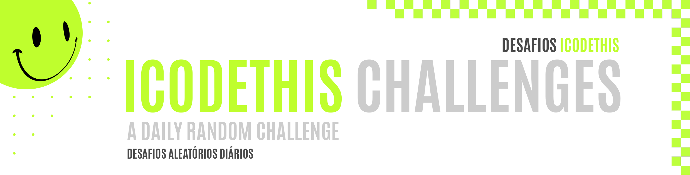
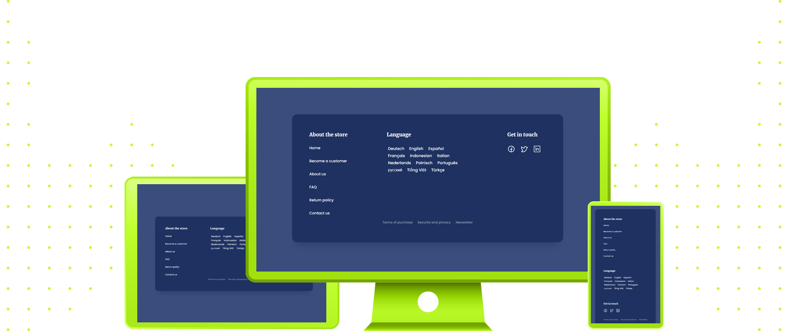

 
 

|         |               
| :-------------:|
|   |
| **Challenge #11:** Pricing Table  | 
| **Original Project:** [🌐](https://github.com/malunaridev/Challenges-iCodeThis/blob/master/9-collections-list/assets/Readme-files/example.jpg?raw=true) / **My Code:** [📄](https://github.com/malunaridev/Challenges-iCodeThis/tree/master/9-collections-list) / **Live Preview:** [🌐](https://challenge-ict-9-collections-list.netlify.app/)  

 
 

Starting a new repository for a new wave of challenges!
I am so glad to be here again!
I will be posting more challenges this time, trying my best to code more everyday, maybe 2-3 challenges a day to keep up with the daily challenges!

 
 
 

- HTML
- CSS

 
 
 

|  Validator  | Passed |
| ------------- | :-------------: |
|[Markup Validation Service](https://validator.w3.org/) - <em>w3.org</em> |   |
|[CSS Validation Service](https://jigsaw.w3.org/css-validator/) - <em>w3.org</em> |   |

 
 
 

This challenge was really simple! I have nothing much to add with this one except pratice and practice, which is the key for whatever you want to achieve. I'm always happy when I build a challenge with no trouble! It means I am getting comfortable with all the selectors and getting used to think as a developer.

 
 
 

